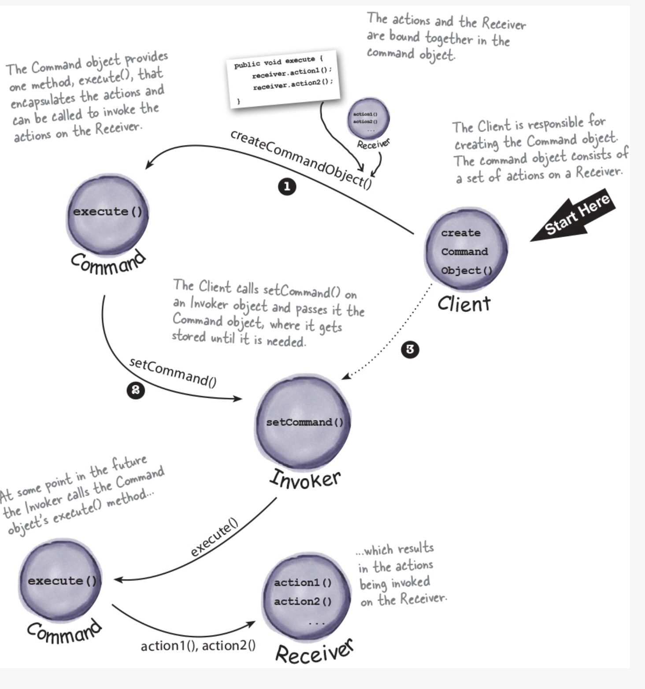

# 5004-Project / Command Pattern

by Yufei Zhang, Zhen Yu Wang, Yi Zheng

## Pattern Description

**The Command Pattern** encapsulates a request as an object, thereby letting us parameterize other
objects with different
requests, queue or log requests, and support undoable operations.

...

### How the pattern works?

...

### When to use this pattern?

#### Secnario1:

...

#### Secnario2:

...

## Code Description

...

### How the code works?

...

### How to run the code?

...

## UML diagram

## Reference

Head First Design Patterns [Book]. (n.d.).
Www.oreilly.com. https://www.oreilly.com/library/view/head-first-design/0596007124/

