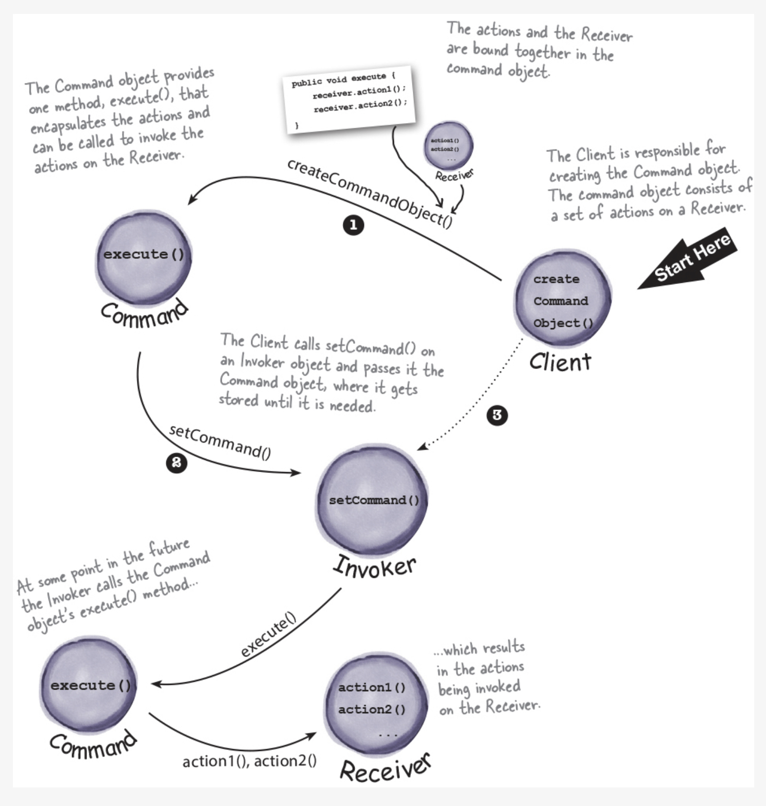

# 5004-Project / Command Pattern

by Yufei Zhang, Zhen Yu Wang, Yi Zheng

## Pattern Description

**The Command Pattern** encapsulates a request as an object, thereby letting us parameterize other
objects with different requests, queue or log requests, and support undoable operations.

### How the pattern works?

The Command pattern is a behavioral design pattern that allows you to encapsulate a request as an
object, thereby allowing you to parameterize clients with different requests, queue or log requests,
and support undoable operations.

The basic idea behind the Command pattern is to provide a way to separate the requester of an action
from the object that actually performs the action. Instead of the requester interacting directly
with the object that performs the action, the requester sends a request to an object called the
Command object, which in turn interacts with the object that performs the action.

The command pattern has a few major components including client, invoker, command, and receiver.
When the client wants to perform an action, it creates a command object and sets its receiver. It
then passes the command object to an invoker object, which stores the command and invokes it at a
later time. When the command is invoked, it calls the appropriate method on the receiver, which
performs the actual action.

### When to use this pattern?

The command design pattern is useful whenever there is a need to separate the request for an action from the implementation of that action. Some examples include, but are not limited to:

#### Secnario1:

In GUI applications, the command pattern can be used to implement menu buttons, which decouples the button object from the object that actually performs the action. In such a design, the button simply sends the request to the command object, while not knowing how the action is performed or what objects are involved. Doing so provides the program with improved modularity and flexibility, as the implementation of the actions and the buttons can be developed, tested, and maintained separately

#### Secnario2:

In a program that supports undo/redo operations across multiple levels, the command pattern can be used to implement an undo/redo method for each command action object. In such a design, the program can use stacks to separately store a history of commands that were called, along with their associated parameters. When the user calls undo/redo, the program simply pops the most recent command object from the stack and calls its undo/redo method. Doing so provides the program with a clear separation of concerns between the command and the underlying logic of the operation, making it easier to add new actions without affecting the existing functionalities

## Code Description

...

### How the code works?

...

### How to run the code?

...

## UML diagram

## Reference

Head First Design Patterns [Book]. (n.d.).
Www.oreilly.com. https://www.oreilly.com/library/view/head-first-design/0596007124/

